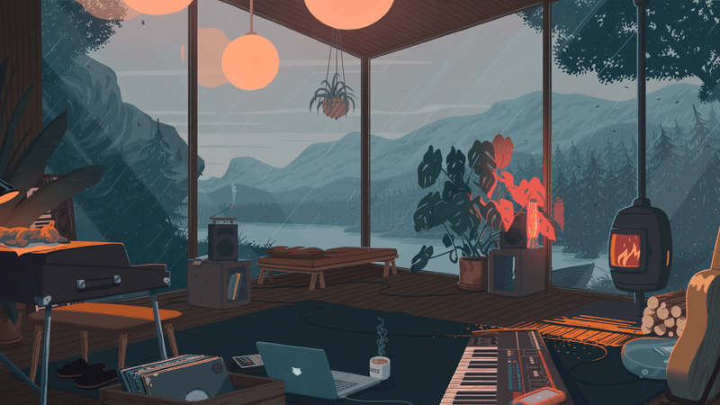

<!-- ============================================================ -->
<!--   TOP HEADER                                                 -->
<!--   1) Silent lofi GIF banner  -> drop at ./assets/banner.gif  -->
<!--   2) "Play the vibe" button  -> opens the music on YouTube   -->
<!-- ============================================================ -->

  

  

<!-- ====== TYPING HEADLINE ====== -->

  

<h3 align="center">Welcome 👋 &nbsp;I'm Aaryan Singh</h3>

  
  

 

## 🪶 About Me

- 🚀 &nbsp;Full-Stack **AI Engineer** — I build things that combine clean UIs with real intelligence.
- 🧠 &nbsp;I work across **RAG, LLMs, and applied ML** — LangChain, FAISS, Gemini, LLaMa.
- 🎓 &nbsp;**B.E. in Artificial Intelligence & Machine Learning**, Mumbai University.
- 📝 &nbsp;Published research on a **Gen-AI chatbot built on LLaMa** (IJSREM, Vol. 09).
- 🌍 &nbsp;Based in **Mumbai, India** — open to building, collaborating, and shipping.
- ⚡ &nbsp;Ask me about **RAG pipelines, LLM apps, full-stack web, and systems work in Rust & Go.**

 

<h3 align="center">🌐 Find Me On</h3>

  
  
  
  

 

<h2 align="center">🧰 Languages & Tools I Work With</h2>

  

  

<h3 align="center">🤖 AI / ML Arsenal</h3>

  
  
  
  
  
  
  

 

<h2 align="center">📊 GitHub Stats</h2>

  
  

  

  

  

 

<h2 align="center">🚀 Featured Projects</h2>

<table align="center">
  <tr>
    <td width="50%" valign="top">
      <h3 align="center">🤖 IRIS</h3>
      
AI chatbot for high-accuracy document Q&A. Gemini API + RAG with dynamic chunking via Q-Learning, on a Streamlit frontend.

      

        
        
        
      

    </td>
    <td width="50%" valign="top">
      <h3 align="center">👕 Buyme</h3>
      
E-commerce UI with interactive 3D clothing models and a Gemini-powered AI virtual try-on. Upload an image, try it on virtually.

      

        
        
        
      

    </td>
  </tr>
</table>

<i>+ Published research: a Gen-AI chatbot built on LLaMa for SSR documents (IJSREM, Vol. 09).</i>

<b><a href="https://github.com/Aaryansingh20?tab=repositories">→ See all repositories</a></b>

 

<h2 align="center">💭 Dev Quote of the Load</h2>

  

 

<!-- ============================================================ -->
<!--   BOTTOM — click to play second video on YouTube (no audio   -->
<!--   plays on the profile itself; opens YouTube on click)       -->
<!-- ============================================================ -->

  

▶ outro vibe — click to watch on YouTube

<i>Let's build something intelligent together. 🚀</i>

